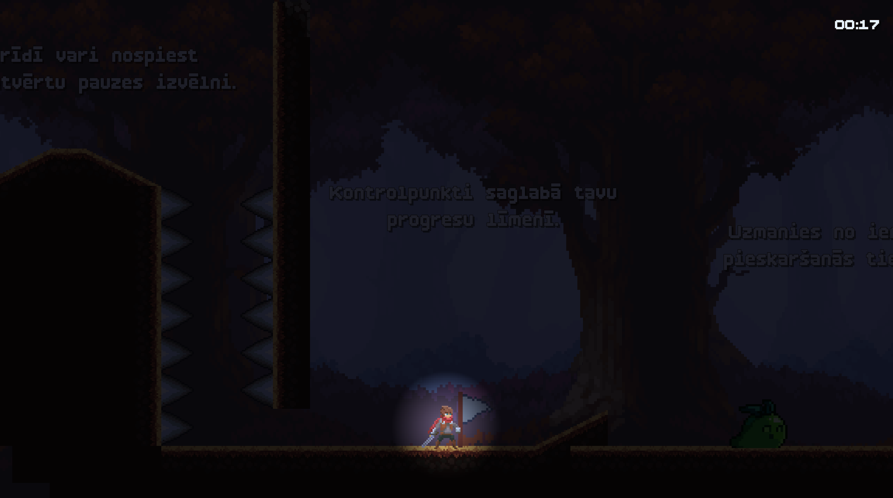
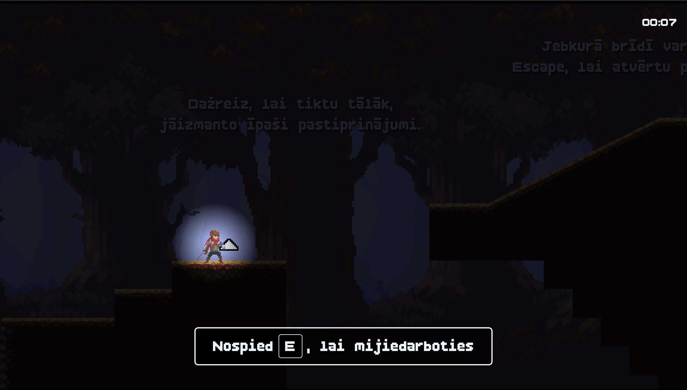
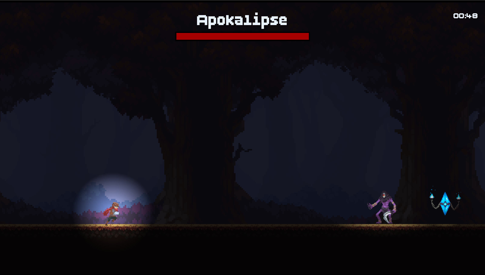
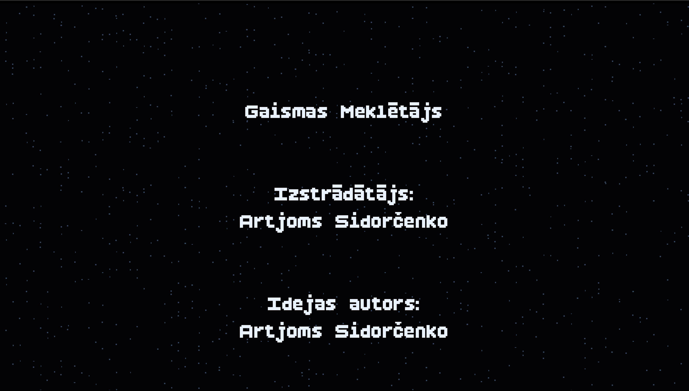

# 🎮 Gaismas Meklētājs / 2D darbības un piedzīvojumu spēle

## 🌟 About the Game / Par spēli

**EN:**  
**Light Seeker** is a 2D action-adventure platformer developed in Godot as a qualification project.  
The player travels through different levels, avoids obstacles and enemies, activates checkpoints, uses temporary ability boosts and restores light by collecting crystals. The game also includes a character shop, settings system, final boss fight and ending credits.

**LV:**  
**Gaismas Meklētājs** ir 2D darbības un piedzīvojumu platformera spēle, kas izstrādāta Godot vidē kā kvalifikācijas darbs.  
Spēlētājs pārvietojas pa dažādiem līmeņiem, izvairās no šķēršļiem un ienaidniekiem, aktivizē kontrolpunktus, izmanto īslaicīgus spēju pastiprinājumus un atjauno gaismu, savācot kristālus. Spēlē ir iekļauts arī personāžu veikals, iestatījumu sistēma, finālā boss cīņa un spēles titri.

---

## 🖼️ Screenshots / Ekrānattēli

### Main Menu / Galvenā izvēlne

### Levels Menu / Līmeņu izvēlne

### Gameplay / Spēles process

### Checkpoint / Kontrolpunkts

### Interactive Object / Interaktīvais objekts

### Settings / Iestatījumi

### Shop / Veikals

### Locker / Skapis

### Boss Fight / Boss cīņa

### Credits / Titri

### Win Screen / Rezultātu logs

---

## 🕹️ Gameplay / Spēles process

**EN:**  
Players control a character who travels through different levels filled with platforms, obstacles, enemies and interactive objects.  
The main gameplay is based on precise movement, jumping, crouching, avoiding danger and interacting with objects. Some levels include checkpoints, moving platforms, breakable platforms, temporary ability boosts and enemies.

**LV:**  
Spēlētājs vada varoni, kurš pārvietojas pa dažādiem līmeņiem ar platformām, šķēršļiem, ienaidniekiem un interaktīviem objektiem.  
Galvenais spēles process balstās uz precīzu kustību, lēkšanu, pietupšanos, izvairīšanos no briesmām un mijiedarbību ar objektiem. Dažos līmeņos ir kontrolpunkti, kustīgās platformas, lūztošās platformas, īslaicīgi spēju pastiprinājumi un ienaidnieki.

---

## 🎯 Objective / Mērķis

**EN:**  
Complete all levels, collect crystals, earn stars, unlock new characters and defeat the final boss to restore the light.

**LV:**  
Pabeigt visus līmeņus, savākt kristālus, iegūt zvaigznes, atbloķēt jaunus personāžus un uzvarēt finālo boss pretinieku, lai atjaunotu gaismu.

---

## 🚀 Features / Galvenās iespējas

**EN:**
- Multiple challenging levels 🏰
- Player movement with jumping, crouching and interaction 🎮
- Obstacles, enemies and moving platforms ⚡
- Breakable platforms and additional level mechanics 🧱
- Checkpoints and respawn system 🔁
- Interactive objects and crystals 💎
- Temporary ability boosts ✨
- Final boss fight with attack mechanics ⚔️
- Final crystal and ending credits 🌌
- Star-based level results ⭐
- Character shop and locker system 🛒
- Video, audio and control settings ⚙️
- Local progress saving 💾

**LV:**
- Vairāki izaicinoši līmeņi 🏰
- Varoņa kustība ar lēcienu, pietupšanos un mijiedarbību 🎮
- Šķēršļi, ienaidnieki un kustīgās platformas ⚡
- Lūztošās platformas un papildu līmeņu mehānikas 🧱
- Kontrolpunktu un atdzimšanas sistēma 🔁
- Interaktīvi objekti un kristāli 💎
- Īslaicīgi spēju pastiprinājumi ✨
- Finālā boss cīņa ar uzbrukuma mehāniku ⚔️
- Finālais kristāls un spēles titri 🌌
- Līmeņu rezultāti ar zvaigznēm ⭐
- Personāžu veikals un skapis 🛒
- Video, audio un vadības iestatījumi ⚙️
- Lokāla progresa saglabāšana 💾

---

## 🎮 Controls / Vadība

**EN:**

| Action | Default Key |
|---|---|
| Move left | A |
| Move right | D |
| Jump | W / Space |
| Crouch | S / Ctrl |
| Interact | E |
| Attack | Left Mouse Button / Enter |
| Pause | Esc |

**LV:**

| Darbība | Noklusējuma taustiņš |
|---|---|
| Kustība pa kreisi | A |
| Kustība pa labi | D |
| Lēciens | W / Space |
| Pietupšanās | S / Ctrl |
| Mijiedarbība | E |
| Uzbrukums | Peles kreisā poga / Enter |
| Pauze | Esc |

---

## ▶️ Running the Game / Spēles palaišana

**EN:**  
Open the project in Godot Engine and run the main scene.  
If an exported version is available, launch the executable file.

**LV:**  
Atver projektu Godot Engine vidē un palaid galveno ainu.  
Ja ir pieejama eksportētā versija, palaid izpildāmo failu.

---

## 🛠️ Technologies / Tehnoloģijas

**EN:**
- Godot Engine
- GDScript
- Aseprite
- GitHub
- External game assets, sound effects and music resources

**LV:**
- Godot Engine
- GDScript
- Aseprite
- GitHub
- Ārējie spēles asseti, skaņas efekti un mūzikas resursi

---

## 💾 Progress Saving / Progresa saglabāšana

**EN:**  
The game saves progress locally, including unlocked levels, collected stars, best results, purchased characters, selected character and settings.

**LV:**  
Spēle saglabā progresu lokāli, tostarp atbloķētos līmeņus, iegūtās zvaigznes, labākos rezultātus, nopirktos personāžus, izvēlēto personāžu un iestatījumus.

---

## 📌 Project Status / Projekta statuss

**EN:**  
The project was developed as a qualification work. The current version includes the main gameplay systems, several levels, character progression, settings, a final boss fight and an ending sequence.

**LV:**  
Projekts tika izstrādāts kā kvalifikācijas darbs. Pašreizējā versijā ir iekļautas galvenās spēles sistēmas, vairāki līmeņi, personāžu progress, iestatījumi, finālā boss cīņa un spēles noslēguma aina.
