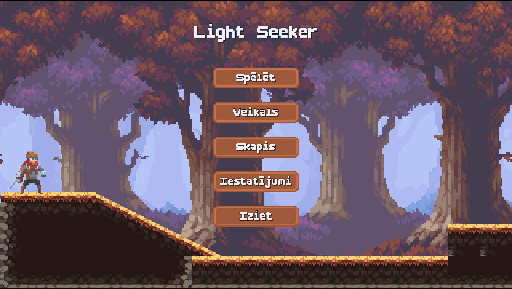
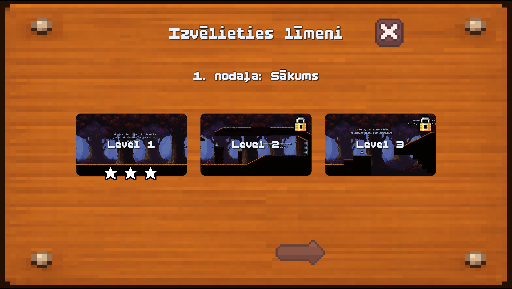
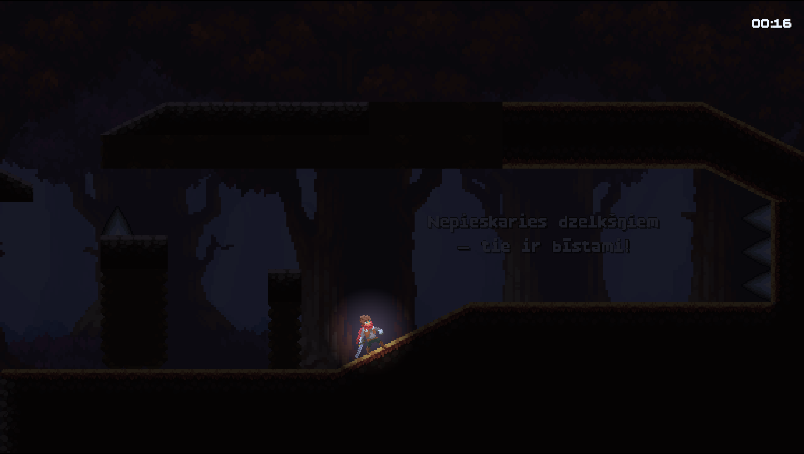
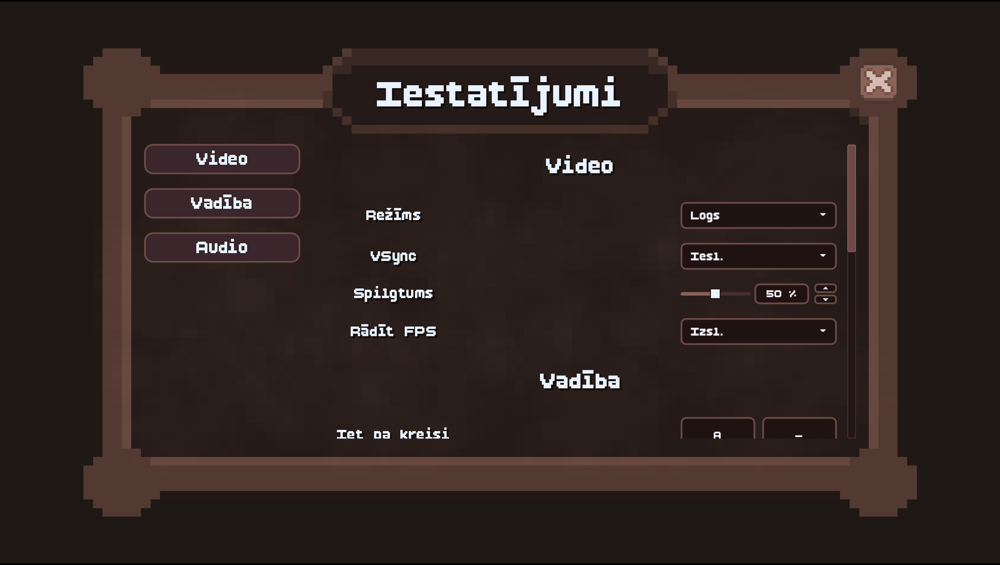
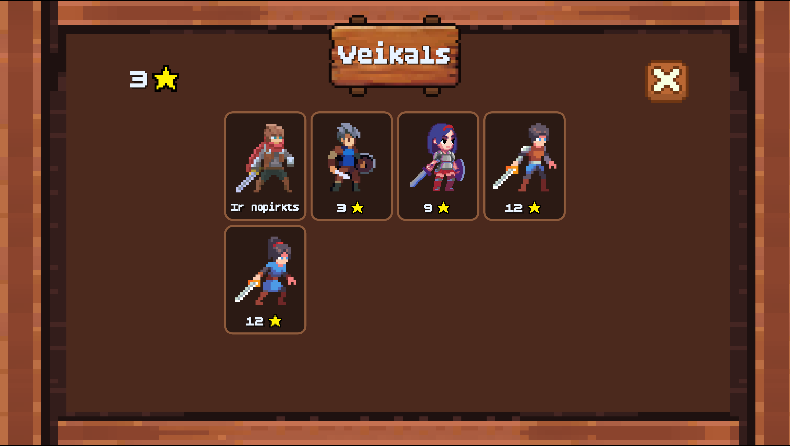
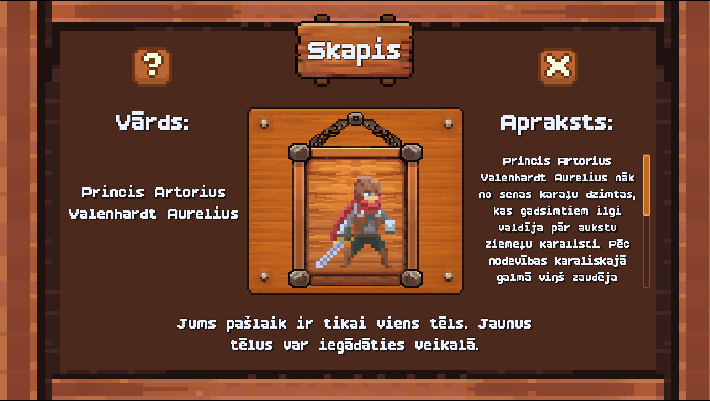
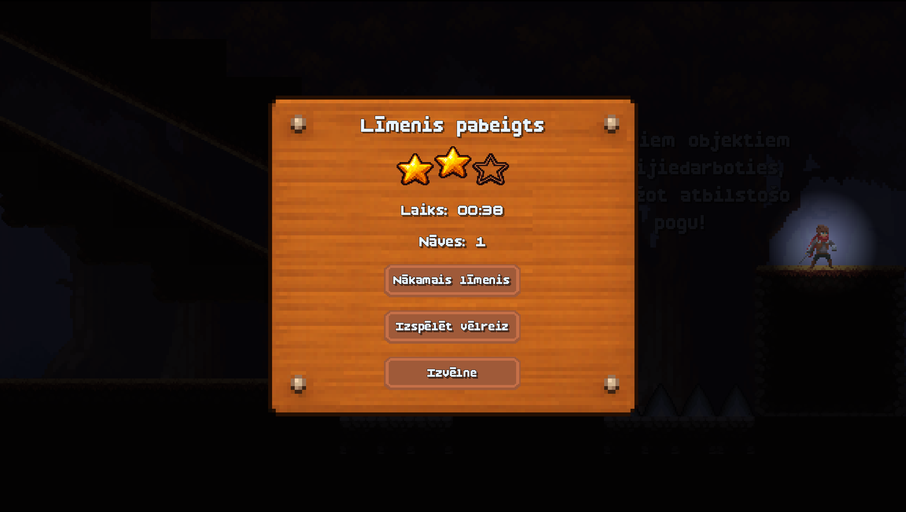

# 🎮 Light Seeker / 2D darbības un piedzīvojumu spēle

## 🌟 About the Game / Par spēli

**EN:**  
**Light Seeker** is a 2D action-adventure platformer developed in Godot as a qualification project.  
The game is inspired by classic platformers and modern action-adventure games, combining precise movement, level progression, obstacles, enemies and collectible rewards.

**LV:**  
**Light Seeker** ir 2D darbības un piedzīvojumu platformera spēle, kas izstrādāta Godot vidē kā kvalifikācijas darbs.  
Spēle ir iedvesmota no klasiskām platformeru spēlēm un mūsdienu darbības–piedzīvojumu projektiem, apvienojot precīzu vadību, līmeņu progresu, šķēršļus, ienaidniekus un iegūstamas balvas.

---

## 🖼️ Screenshots / Ekrānattēli

### Main Menu / Galvenā izvēlne

### Levels Menu / Līmeņu izvēlne

### Gameplay / Spēles process

### Settings / Iestatījumi

### Shop / Veikals

### Locker / Skapis

### Win Screen / Rezultātu logs

---

## 🕹️ Gameplay / Spēles process

**EN:**  
Players control a character who travels through different levels filled with platforms, obstacles, enemies and interactive objects.  
The goal is to complete each level, collect rewards, avoid danger and improve the final result.

**LV:**  
Spēlētājs vada varoni, kurš pārvietojas pa dažādiem līmeņiem ar platformām, šķēršļiem, ienaidniekiem un interaktīviem objektiem.  
Mērķis ir pabeigt katru līmeni, iegūt balvas, izvairīties no briesmām un uzlabot gala rezultātu.

---

## 🎯 Objective / Mērķis

**EN:**  
Complete the levels, master the game mechanics, collect stars and unlock new characters.

**LV:**  
Pabeigt līmeņus, apgūt spēles mehānikas, iegūt zvaigznes un atbloķēt jaunus personāžus.

---

## ✨ Inspiration / Iedvesma

**EN:**  
The game draws inspiration from classic 2D platformers and adventure games, where movement accuracy, timing and level exploration are important.

**LV:**  
Spēle ir iedvesmota no klasiskām 2D platformeru un piedzīvojumu spēlēm, kur svarīga ir precīza kustība, pareizs laiks un līmeņu izpēte.

---

## 🚀 Features / Galvenās iespējas

**EN:**
- Multiple challenging levels 🏰
- Player movement with jumping, crouching and interaction 🎮
- Obstacles, enemies and moving platforms ⚡
- Checkpoints and respawn system 🔁
- Interactive objects and crystals 💎
- Temporary ability boosts ✨
- Star-based level results ⭐
- Character shop and locker system 🛒
- Video, audio and control settings ⚙️
- Local progress saving 💾

**LV:**
- Vairāki izaicinoši līmeņi 🏰
- Varoņa kustība ar lēcienu, pietupšanos un mijiedarbību 🎮
- Šķēršļi, ienaidnieki un kustīgās platformas ⚡
- Kontrolpunktu un atdzimšanas sistēma 🔁
- Interaktīvi objekti un kristāli 💎
- Īslaicīgi spēju pastiprinājumi ✨
- Līmeņu rezultāti ar zvaigznēm ⭐
- Personāžu veikals un skapis 🛒
- Video, audio un vadības iestatījumi ⚙️
- Lokāla progresa saglabāšana 💾

---

## 🎮 Controls / Vadība

**EN:**

| Action | Default Key |
|---|---|
| Move left | A |
| Move right | D |
| Jump | W / Space |
| Crouch | S / Ctrl |
| Interact | E |
| Pause | Esc |

**LV:**

| Darbība | Noklusējuma taustiņš |
|---|---|
| Kustība pa kreisi | A |
| Kustība pa labi | D |
| Lēciens | W / Space |
| Pietupšanās | S / Ctrl |
| Mijiedarbība | E |
| Pauze | Esc |

---

## 🛠️ Technologies / Tehnoloģijas

**EN:**
- Godot Engine
- GDScript
- Aseprite
- GitHub

**LV:**
- Godot Engine
- GDScript
- Aseprite
- GitHub

---

## 💾 Progress Saving / Progresa saglabāšana

**EN:**  
The game saves progress locally, including unlocked levels, collected stars, selected characters and settings.

**LV:**  
Spēle saglabā progresu lokāli, tostarp atbloķētos līmeņus, iegūtās zvaigznes, izvēlētos personāžus un iestatījumus.

---

## 📌 Project Status / Projekta statuss

**EN:**  
The project is currently being developed as part of a qualification work.

**LV:**  
Projekts pašlaik tiek izstrādāts kvalifikācijas darba ietvaros.
